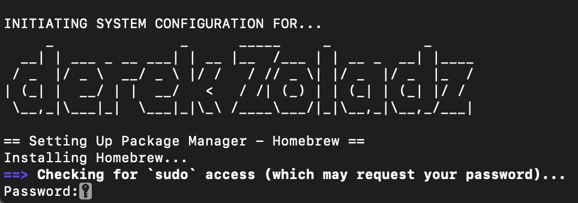

DOTFILES
========

Tooling to bootstrap a fresh install of macOS on Apple M1 silicon to my specifications.

## Installation

Curl and unarchive the specified release from `https://github.com/dzoladz/.dotfiles/releases`

1. `mkdir ~/.dotfiles && cd ~/.dotfiles`
2. `curl -o release.tar.gz RELEASE_URL/release.tar.gz`
4. `tar -xzvf release.tar.gz`

## Dependencies (repositories)

+ [.vim](https://github.com/dzoladz/.vim) - text editor configuration files
+ [Wahlpypa](https://github.com/dzoladz/wahlpypa) - Desktop wallpaper for macOS
